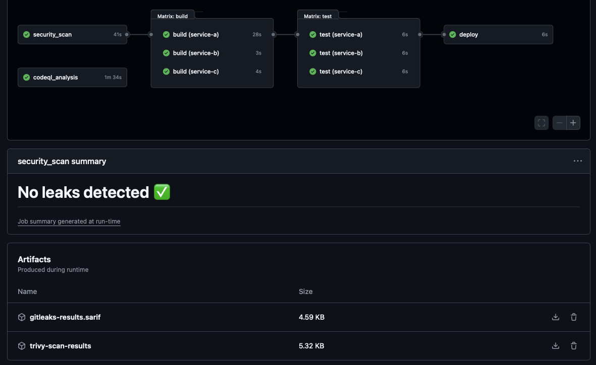
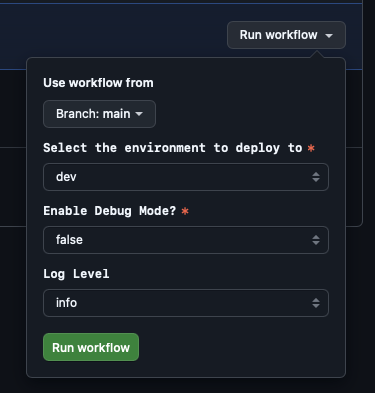
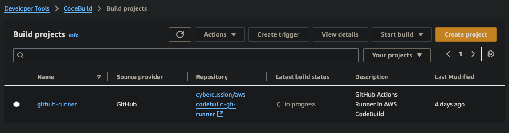

# AWS Codebuild Github Runner Demo


`.github/workflow/` location for jobs.

- Requires Codestar Connection (hides under Settings->Connection in CodeBuild)
  - Remember if you provision this with IaC it still has to be manually "connected" to Github.
- Requires Authorized Connection in Connection (developer tools)
  - Will go from PENDING, to AVAILABLE once connected.  I used "Install App"
- Requires Established CodeBuild Runner for Github
  - Can provision this with IaC, requires your ARN from CodeStar Connection
- Requires you get your permissions right on CodeBuild for whatever this does in AWS
  - Policies to start/stop codebuild, access resources in AWS, least privileges.
- Requires github action job for runs-on:
- Split your self-hosted codebuild github runner (AWS) with your managed github action runner (Azure).

```yaml
name: Hello World
on: [push]
jobs:
  Hello-World-Job:
    runs-on:
      - codebuild-<your runner name>-${{ github.run_id }}-${{ github.run_attempt }}
    steps:
      - run: echo "Hello World"
```

## Github Actions

Actions tab, jobs/workflows



### Manual Workflow



## CodeBuild (Github Runner)

Provisioned CodeBuild processing Github Action Jobs.



## Infrastructure as Code (IaC)

See the `infra/` folder for options/README(s).
